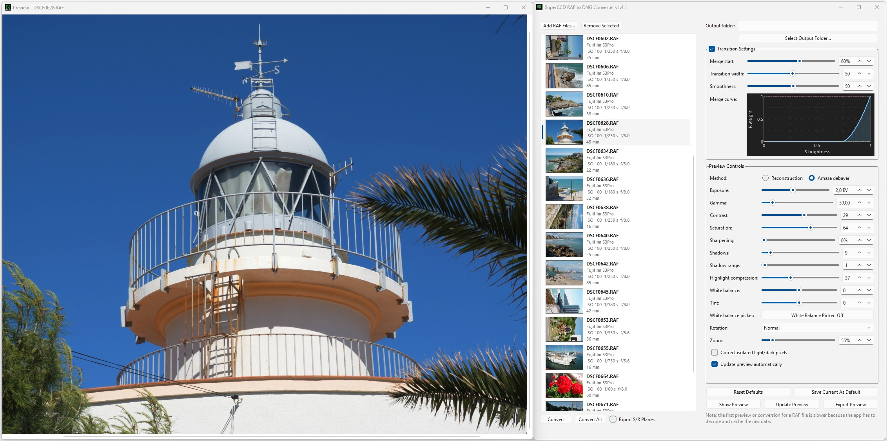

# SuperCCD S3/S5 RAF to DNG

Desktop application for converting Fujifilm FinePix `S3 Pro` and `S5 Pro` `.RAF` files into editable `DNG` files, with a focus on the Super CCD SR II sensor's separate `S` and `R` responses. The development work was centered on `S3 Pro` files, but `S5 Pro` files are also supported.



## Project Status

This repository is currently centered on one supported output path:

- `6MP Raw CFA DNG`

That path is the stable result of the current work and is the main archival and editing output.

The application also has a strong preview export path for rendered output review:

- `JPEG` preview export at `12MP` or `6MP`
- `16-bit TIFF` preview export at `12MP` or `6MP`

Those preview exports are derived from the app's high-quality internal preview pipeline and can produce very usable final-looking images, even though they are not the raw-preserving workflow.

## AI-Origin Statement

This project was developed **100% with AI, with no manual intervention in the implementation**.

- Human author and maintainer: `Eduardo Anibarro`
- Code, refactors, UI changes, reverse-engineering iterations, and documentation were generated through AI-assisted sessions

That statement is included here deliberately so contributors understand the origin of the codebase before working on it.

## What The Application Does

- Loads one or more Fujifilm `S3 Pro` or `S5 Pro` `RAF` files
- Extracts separate `S` and `R` shot data
- Merges both responses into a highlight-safe `6MP` CFA DNG
- Preserves the original embedded RAF preview for the GUI file list and DNG preview embedding
- Provides a preview workflow for tuning the `S/R` highlight handoff before export
- Exports the adjusted preview as `JPEG` or lossless `16-bit TIFF`

## Current Scope

Supported and intended:

- Fujifilm FinePix `S3 Pro` and `S5 Pro` RAF files
- Windows
- macOS
- Raspberry Pi OS on ARM64 Raspberry Pi devices
- Qt 6 desktop GUI
- `6MP Raw CFA DNG` export
- high-quality preview export as `JPEG` or `16-bit TIFF` at `12MP` or `6MP`

Present in source but not a supported workflow:

- legacy experimental `12MP` linear export code, exposed as `ExportMode::Linear12MPExperimental` and the CLI flag `--12mp-linear`
- older diagnostic and reverse-engineering helpers inside `SuperCCDProcessor.cpp`, including detailed processing logging, `exiftool` thumbnail fallback code, and FujiCurve export helpers

Those paths remain in the repository as research and troubleshooting history. They are not the recommended path for normal use. This does not apply to the supported preview export feature, which can export rendered previews at `12MP` or `6MP`.

## Preview Export Quality

Preview export is not just a debugging feature. The application renders preview adjustments from a 16-bit internal image path, and the exported preview can produce surprisingly strong image quality for practical use.

- `16-bit TIFF` preview export preserves the rendered 16-bit RGB result without JPEG compression
- preview exports include the current live adjustments, including white balance, tint, gamma, contrast, saturation, highlight compression, and sharpening
- exports are available at `6MP` and `12MP`
- this is a good path when you want a strong rendered image directly from the app instead of a raw-editing workflow in RawTherapee

## Why The Output Is A CFA DNG

The stable workflow keeps the merged data as a CFA DNG because:

- it preserves more editability than a baked RGB render
- RawTherapee currently gives better detail than the app's abandoned linear-DNG experiments
- the merged CFA path is the most reliable result reached so far

The intended post-processing workflow is:

1. Convert RAF to `6MP Raw CFA DNG`
2. Open the DNG in RawTherapee
3. Apply the included RawTherapee profile from `RawTherapee profile\s3pro_dng.pp3`
4. Demosaic and finish the image there

Important:

- the generated DNG is currently a rotated output
- final orientation and framing are expected to be corrected in RawTherapee

## Included RawTherapee Profile

This repository includes a starter RawTherapee processing profile:

- `RawTherapee profile\s3pro_dng.pp3`

It is meant as a basic correction preset for the generated S3 Pro DNG files. The profile applies a starting point for:

- exposure compensation and highlight compression
- white balance based on camera metadata
- tone equalizer adjustments
- a default crop and rotation
- AMaZE demosaicing
- post-demosaic sharpening

Use it as a baseline, not as a finished look. You should still expect to fine-tune exposure, crop, color, and sharpening per image.
The included crop and rotation are already part of the profile.

### Using The Profile Manually

1. Open a converted `*_sr_merged.dng` in RawTherapee.
2. Load `RawTherapee profile\s3pro_dng.pp3` as a processing profile.
3. Adjust the result as needed for the specific image.

### Setting Up A Dynamic Default Profile In RawTherapee

If you want RawTherapee to apply this profile automatically to these DNG files:

1. Make the profile available to RawTherapee.
2. In RawTherapee, open `Preferences`.
3. Set the default processing profile for raw files to `(Dynamic)`.
4. Open the `Dynamic Profile Rules` section.
5. Add a rule for the Fujifilm S3 Pro DNG workflow.
6. Set the `Camera` condition to match the camera metadata shown by RawTherapee for these files.
7. Attach `s3pro_dng.pp3` to that rule.
8. Keep the rule near the end of the rule list if you want it to override more general raw defaults.
9. For files already visible in the file browser, use `Processing Profile Operations > Reset to Default` so the dynamic chain is applied again.

RawPedia notes that dynamic rules are combined in list order, and later matching rules can override earlier ones. See: https://rawpedia.rawtherapee.com/Dynamic_processing_profiles

## Key Limitations

- The project is specialized for the Fujifilm Super CCD SR II workflow and was developed primarily around `S3 Pro` files, although `S5 Pro` files are also supported
- The output is intentionally highlight-safe by default, so images may open darker than a normal camera raw
- Some experimental code remains in the repository and should not be treated as stable API
- The codebase is usable, but it is still research-driven rather than polished as a general-purpose photo product

## GUI Features

- RAF file list with embedded thumbnails
- independently resizable preview window for the currently selected RAF file
- draggable and zoomable preview
- preview exposure, white-balance, and tint controls
- preview gamma, contrast, saturation, sharpening, and highlight compression controls
- preview rotation options
- preview export as `JPEG` or lossless `16-bit TIFF`
- preview export at `6MP` or `12MP`
- adjustable `S -> R` highlight handoff parameters
- optional export of individual S and R plane images
- convert current previewed RAF
- convert all listed RAF files
- drag-and-drop support for adding RAF files
- save and restore default parameter values

Performance note:

- the first preview or conversion of a RAF file is slower because the app must decode and cache the raw data
- CPU-heavy cache, merge, alignment, demosaic, and preview cleanup stages use the available CPU cores
- the independent `S` and `R` RAF shots are decoded concurrently
- an individual LibRaw decode can still contain a short single-core phase
- repeated previews on the same file are faster

## Command Line

Convert a RAF file:

```powershell
superccd2dng.exe input.raf output.dng --6mp-cfa
```

Display the installed version without opening the GUI:

```powershell
superccd2dng.exe --version
```

The short version option is `-v`.

## Build Requirements

- CMake `3.16+`
- Qt `6` with `Widgets`
- LibRaw
- LibTIFF
- a supported platform toolchain:
  - Visual Studio C++ on Windows
  - Xcode command line tools / Clang on macOS
  - GCC or Clang on Raspberry Pi OS ARM64


## Build

This repository includes platform-specific build entrypoints:

- Windows: `build_windows.cmd`
- macOS: `build_macos.sh`
- Raspberry Pi: `build_rpi.sh`

Typical build commands:

Windows:

```powershell
cmd /c build_windows.cmd build
```

macOS:

```bash
chmod +x build_macos.sh
./build_macos.sh build
```

Raspberry Pi:

```bash
chmod +x build_rpi.sh
./build_rpi.sh build
```

Release packaging:

Windows:

```powershell
cmd /c build_windows.cmd package
```

macOS:

```bash
./build_macos.sh package
```

Raspberry Pi:

```bash
./build_rpi.sh package
```

The Windows package creates a zip in `dist\` with a default name like `superccd2dng-windows-x64-1.3.1.zip`.
You can override the Windows package name:

```powershell
cmd /c build_windows.cmd package superccd2dng-windows-x64-v0.1.0
```

Platform-specific build guides:

- [docs/MACOS_BUILD.md](docs/MACOS_BUILD.md)
- [docs/RASPBERRYPI_BUILD.md](docs/RASPBERRYPI_BUILD.md)

If you need to configure from scratch manually, the important CMake inputs are:

- `Qt6_DIR`
- `LIBRAW_ROOT`
- optionally `TIFF_ROOT`

Example:

```powershell
cmake -S . -B build ^
  -G "Visual Studio 18 2026" -A x64 ^
  -DQt6_DIR="X:/path/to/Qt/lib/cmake/Qt6" ^
  -DLIBRAW_ROOT="X:/path/to/libraw" ^
  -DTIFF_ROOT="X:/path/to/libtiff"
cmake --build build --config Release
```

## Command-Line Usage

Minimal usage:

```powershell
build\superccd2dng.exe input.raf output.dng --6mp-cfa
```

Important behavior:

- the app writes three files from that base output name:
  - `_s_pixels.dng`
  - `_r_pixels.dng`
  - `_sr_merged.dng`
- the merged file is the main result

Example:

```powershell
build\superccd2dng.exe samples\DSCF0125.RAF tests\DSCF0125.dng --6mp-cfa
```
## Repository Structure

- [src](src)
  - application code
- [resources](resources)
  - icons and Qt resources
- [docs/MANUAL.md](docs/MANUAL.md)
  - end-user application manual
- [CONTRIBUTING.md](CONTRIBUTING.md)
  - contributor notes
- [THIRD_PARTY_NOTICES.md](THIRD_PARTY_NOTICES.md)
  - dependency and attribution notes

## Contributor Expectations

If you want to contribute, read:

- [docs/MANUAL.md](docs/MANUAL.md)
- [CONTRIBUTING.md](CONTRIBUTING.md)

In practice:

- do not change the stable `6MP` merge behavior casually
- treat highlight recovery regressions as critical
- test against real RAF files, not only synthetic examples

## License

This repository is licensed under the MIT License.

See [LICENSE](LICENSE).
